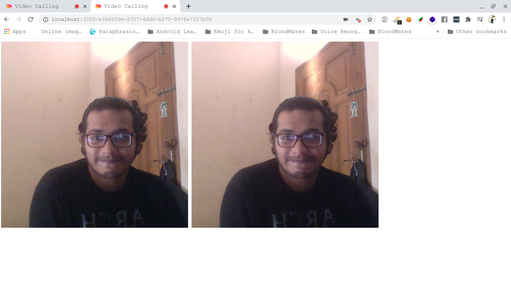

# Conferencing - Video Calling

## Abstract

> Free open-source video conferencing solution for web. It setups multiple peer connections to support multi-user connectivity feature. Entire system is developed with WebRTC. Peer to peer calling supports 256 peer conections at a time. It means 256 users can be interconected in a single room.

## Features

- [ ] Authentication
- [ ] Video Call
- [x] Conferance Call
- [ ] Switch from Audio call to Video call or vice versa
- [ ] Screen sharing
- [ ] record conferance call
- [ ] Chat

## Requirements

For development, you will only need Node.js and node global packages - npm, peerjs installed in your environement.

If the installation was successful, you should be able to run the following command.

    $ node --version
    v12.17.0

    $ npm --version
    6.14.6

You need install a global packages -

    $ npm install -g peerjs

## Installation

    $ git clone https://github.com/samiurprapon/conferencing
    $ cd conferencing
    $ npm install

#### Running the project

Start the server

    $ npm run test

Open an another terminal -

    $ peerjs --port 3001

## Demo

> 

## Acknowledgements

* This is the easiest possible way to build a WebRTC based calling system.

